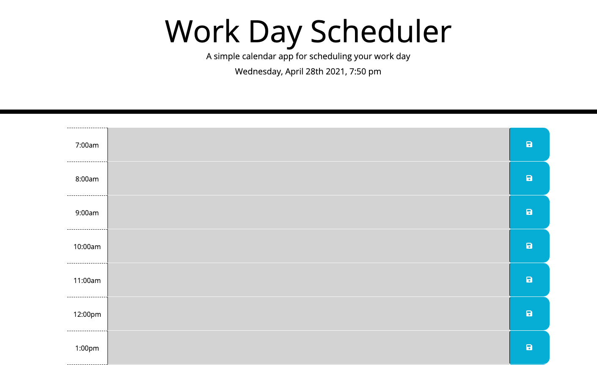

# work_day_scheduler

## Project Goal

Build a simple day planner that allows the user to add important events and save those events to local storage.

## Project Scope

1. Display current day and time at the top of the day planner.
2. Build time blocks for each hour from 7am to 7pm.
3. Time block for current time has a background color red.
4. Time block for future times have a background color green.
5. Time block for past times have a background color grey.
6. Create functional save button for each time block to enable storage of texted entered in specified time block.
7. When save button is clicked, display message at top of page informing the user their save was successful.
8. When page is reloaded the users saved text is persistent.

## Deployed Screen-Shot

## Deployed Application Link
https://brunett82.github.io/work_day_scheduler/

## Project Owner

Rob Brunett

## Project Completion Date

05/01/2021